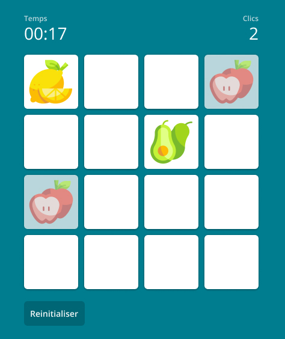

<h1 align="center">OptiSantis Test Développeur FrontEnd</h1>

    <a href="#prérequis">Prérequis</a> • <a href="#composants">Composants</a> • <a href="#bonus">Bonus</a> • <a href="#final">Final</a>

    

Pour tester les compétences `React/Typescript` et d'intégration `HTML/CSS/SASS`, vous développerez un jeux de type [Memory](https://fr.wikipedia.org/wiki/Memory_(jeu)).

> 🚨 Les librairies de composants tel que `Bootstrap`, `MaterialUI` sont déconseillées. Pour le reste vous êtes libre d'utiliser les outils qui vous paraissent les plus adaptés.

## Prérequis

* [React](https://reactjs.org/) - v.16 minimum
* [Typescript](https://www.typescriptlang.org/)
* [SCSS](https://sass-lang.com/)

## Composants

### Grille

Une grille `4x4` qui a pour contenu les cartes du jeux.

### Carte

| Idle  | Checked  | Disabled  |
|:-:|:-:|:-:|
|  |  |  |

**Faces :**
La carte a deux faces : 
* `recto` : background
* `verso` : une image devant être associée à une paire

**États :**
* `idle` : La carte n'est pas retourné
* `checked` : La carte a été cliqué et retourné
* `disabled` : La carte et sa paire ou été trouvé

**Action :**
* `click` -> Retourne la carte sur son verso. Si la carte cliqué est la première à être retournée de la partie, alors lancer le `Timer`.

### Timer

**Comportement :** Dès que l'utilisateur clique sur la première carte le `Timer` ce lance. 

### Compteur de clics

**Comportement :** Dès que l'utilisateur clique sur deux cartes, alors le compteur est incrémenter d'un clique. 

### Reset

Un `bouton` permettant de réinitialiser la grille et de remélanger les paires, réinitialise le `Timer` et le `Compteur`.

**Action :** 
* `click` -> Réinitialise la partie en cours. Si aucune partie n'est en cours, alors le bouton doit être désactivé.

## Bonus

Dans un soucis d'accessibilité, la grille doit être navigable avec le clavier et les carte peuvent être actionner avec les touches `entrée` et `espace`.

## Final

Pour nous envoyer le résultat, il vous suffira de créer une `merge-request` sur le [repo Github](https://github.com/optisantis/test-front).
